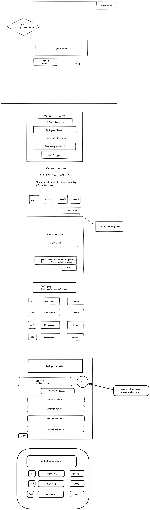

# HERE LIES THE TRUTH TO ALL OUR SOURCE OF TRUTH

## NAMING CONVENTIONS

- FILE NAMES: camelCase
- CODE: camelCase

## TECHNOLOGIES

### DATABASE

- MongoDB Atlas

### FRONTEND

- HTML
- CSS
- JavaScript
- React

### BACKEND

- Jest
- Express/Node.js

## DESIGN

## MORE FEATURES

Avatar selection
Leave game option
Go back button
easter egg

## STRETCH GOALS

- Badges based on user's own highscore
- In-game chat option
- Schedule a game to start (+ below)
- Email-sent invitation to play
- Add share results feature (to FB, Twitter etc.)
- Auth & Auth
